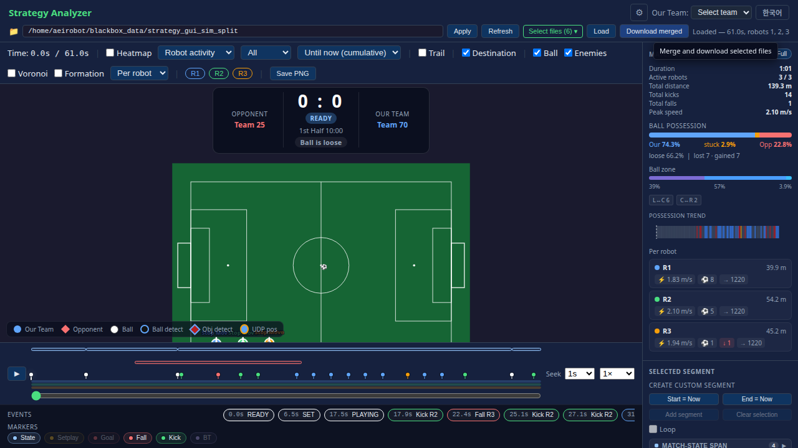

# robocup_match_analyze_tools

A collection of open-source ROS 2 tools for recording, simulating, monitoring, and analyzing RoboCup humanoid soccer matches. Each package is independent and can be used separately.

---

## Packages

| Package | Description | Port |
|---------|-------------|------|
| [robocup_blackbox](robocup_blackbox/) | Real-time MCAP topic recorder running on the robot | — |
| [robocup_realtime_monitoring](robocup_realtime_monitoring/) | Live match dashboard receiving UDP team messages | 8094 |
| [robocup_match_2d_simulation](robocup_match_2d_simulation/) | 2D physics match simulator with a built-in browser UI | 8095 |
| [robocup_match_analyzer](robocup_match_analyzer/) | Browser-based post-match analysis of MCAP recordings | 8096 |
| [robocup_msgs](robocup_msgs/) | Custom ROS 2 message definitions shared by all packages | — |

---

## System Overview

```
                    ┌──────────────────────────────────────────────────────┐
                    │              On the Robot (during match)              │
                    │                                                       │
                    │   ROS 2 Topics                                        │
                    │       │                        │                      │
                    │       ▼                        ▼                      │
                    │  robocup_blackbox         robot software              │
                    │  (MCAP recorder)          (UDP sender)                │
                    │       │                        │                      │
                    └───────┼────────────────────────┼──────────────────────┘
                            │ MCAP files             │ UDP MessageV2 broadcast
                            ▼                        ▼
                   robocup_match_analyzer    robocup_realtime_monitoring
                   (post-match web UI)       (live match web UI)
                   http://localhost:8096     http://localhost:8094
                                                      ▲
                                                      │ UDP MessageV2 broadcast (same format)
                                             robocup_match_2d_simulation
                                             (2D simulator, no hardware needed)
                                             http://localhost:8095
```

### How the tools connect

| When | Tool | Purpose |
|------|------|---------|
| During a real match | `robocup_blackbox` | Records all ROS topics to MCAP files on the robot |
| During a real match | `robocup_realtime_monitoring` | Shows live positions and strategy on a sideline laptop |
| After a match | `robocup_match_analyzer` | Loads MCAP files to replay, inspect events, and compute statistics |
| During development | `robocup_match_2d_simulation` | Replaces real robots — feeds `robocup_realtime_monitoring` via UDP |

---

## Screenshots


> *Live match dashboard showing robot positions, ball, opponents, and strategy zones.*



> *Post-match replay with heatmap, Voronoi space control, and event timeline.*


> *2D simulator UI with ally robots (circles), opponents (diamonds), and ball.*

> **To contributors:** add actual screenshots to `docs/images/` to replace these placeholders.

---

## Build

Build all packages at once:

```bash
cd <workspace>
colcon build --packages-select \
  robocup_msgs \
  robocup_blackbox \
  robocup_realtime_monitoring \
  robocup_match_2d_simulation \
  robocup_match_analyzer
source install/setup.bash
```

> Build `robocup_msgs` first — all other packages depend on it.

---

## Quick Launch Reference

```bash
# Record during a match (on the robot)
ros2 launch robocup_blackbox local_record.launch.py robot_id:=robot_1

# Live monitoring (sideline laptop)
ros2 launch robocup_realtime_monitoring robocup_realtime_monitoring.launch.py
# → http://localhost:8094

# 2D simulation (development, no hardware)
ros2 launch robocup_match_2d_simulation sim.launch.py
# → http://localhost:8095

# Post-match analysis
ros2 launch robocup_match_analyzer analyzer.launch.py data_dir:=~/blackbox_data
# → http://localhost:8096
```

---

## Dependencies

| Requirement | Notes |
|-------------|-------|
| ROS 2 (Jazzy or later) | All packages |
| `rosbag2-storage-mcap` | `robocup_blackbox`, `robocup_match_analyzer` |
| Python ≥ 3.10 | Python packages |
| `fastapi`, `uvicorn` | `robocup_realtime_monitoring`, `robocup_match_2d_simulation`, `robocup_match_analyzer` |

```bash
sudo apt install ros-${ROS_DISTRO}-rosbag2-storage-mcap \
                 ros-${ROS_DISTRO}-rosbag2-cpp \
                 ros-${ROS_DISTRO}-diagnostic-msgs
pip install fastapi uvicorn pydantic pyyaml
```

---

## Repository Structure

```
robocup_match_analyze_tools/
├── robocup_msgs/                  # Custom ROS 2 message definitions (C++)
├── robocup_blackbox/              # MCAP recorder node (C++)
├── robocup_realtime_monitoring/   # Live match dashboard (Python)
├── robocup_match_2d_simulation/   # 2D physics simulator (Python)
└── robocup_match_analyzer/        # Post-match MCAP analyzer (Python)
```

---

## License

See each package directory for its license file.
