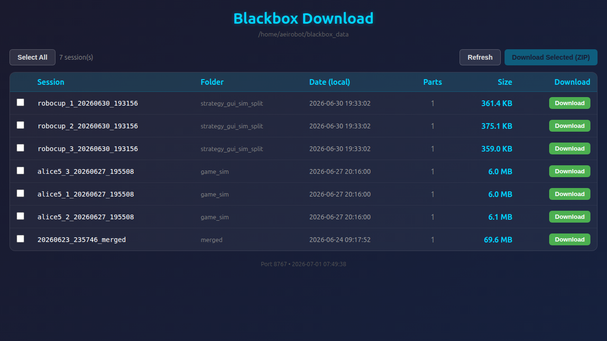

# robocup_blackbox

A high-performance MCAP blackbox recorder for RoboCup robots. Records ROS 2 topics in real time with per-topic Hz throttling, automatic file splitting, and optional health monitoring.



> *Screenshot: browser-based session download UI. Add a screenshot here after launching `web_download`.*

---

## Features

- **Per-topic Hz throttling** — record each topic at an independent rate (e.g., joint states at 50 Hz, game control at 10 Hz)
- **Auto file split** — new MCAP file starts when accumulated message bytes exceed `max_file_size` (default 2 GB)
- **Retention management** — automatically deletes oldest sessions when `max_bag_count` is exceeded
- **Web download UI** — browse and download recorded sessions from any browser without SCP
- **Live stream** — optionally re-publishes throttled topics on ROS for real-time monitoring

---

## Quick Start

### Build

```bash
cd <workspace>
colcon build --packages-select robocup_blackbox
source install/setup.bash
```

### Record (single robot)

```bash
ros2 launch robocup_blackbox local_record.launch.py robot_id:=robot_1
```

Recordings are saved to `~/blackbox_data/robot_1_YYYYMMDD_HHMMSS.mcap/`.

### Download recorded sessions

```bash
ros2 run robocup_blackbox web_download
# Open http://localhost:8767 in a browser
```

---

## Configuration

Two YAML files control recording behavior. All live in `config/`.

### `record_profile.yaml` — which topics to record

```yaml
output_dir: "~/blackbox_data"
timer_period_ms: 10.0          # drain interval (ms) → max effective Hz = 1000/timer_period_ms

topics:
  - topic: "/joint_states"
    hz: 50.0                   # downsample to 50 Hz
    queue_size: 500
  - topic: "/robocup/udp/data"
    hz: 0.0                    # record all messages (no throttle)
  - topic: "/excluded_topic"
    hz: -1.0                   # exclude from recording
```

| `hz` value | Behavior |
|-----------|----------|
| `> 0` | Downsample to that Hz |
| `0` | Record every message |
| `< 0` | Exclude |

### `mcap_settings.yaml` — compression and file size

```yaml
mcap:
  compression: "zstd"        # none | zstd | lz4
  compression_level: 3       # 1=fastest … 5=smallest
  max_file_size: 2147483648  # 2 GB — triggers auto-split
  max_bag_count: 5           # keep at most 5 sessions
```

---

## Launch Arguments

| Argument | Default | Description |
|----------|---------|-------------|
| `robot_id` | `${ROBOCUP_GENERATION}_${ROBOCUP_ROBOT_ID}` | Prefix added to all recorded topic names |
| `config_file` | `robocup_blackbox/config/record_profile.yaml` | Recording profile |
| `compression` | `none` | Override compression (`zstd`, `lz4`, `none`) |

---

## Topic Naming

Every recorded channel gets `robot_id` prepended:

```
/joint_states  →  robot_1/joint_states
/robocup/localization/pose  →  robot_1/robocup/localization/pose
```

This allows multiple robots' recordings to be merged without channel name conflicts.

---

## Multi-Robot Recording

```bash
ros2 launch robocup_blackbox strategy_gui_sim_split_record.launch.py
```

Starts one recorder node per robot. Each node writes to its own session directory.

---

## Playback

```bash
ros2 bag play ~/blackbox_data/robot_1_20260620_143022.mcap \
  --remap robot_1/joint_states:=/joint_states
```

> The `robot_id` prefix must be remapped if downstream nodes expect bare topic names.

---

## Architecture

```
ROS Publishers
     │  (subscriptions via QoS auto-detect)
     ▼
ThrottleQueue (per topic)   ← Hz limiter + ring buffer
     │  (drained every timer_period_ms)
     ▼
McapWriter (rosbag2_cpp)    ← file split, compression
     │
     ▼
~/blackbox_data/robot_1_YYYYMMDD_HHMMSS.mcap/
     └── robot_1_YYYYMMDD_HHMMSS_0.mcap
```

---

## Dependencies

```bash
sudo apt install ros-${ROS_DISTRO}-rosbag2-storage-mcap \
                 ros-${ROS_DISTRO}-rosbag2-cpp \
                 ros-${ROS_DISTRO}-diagnostic-msgs
```
