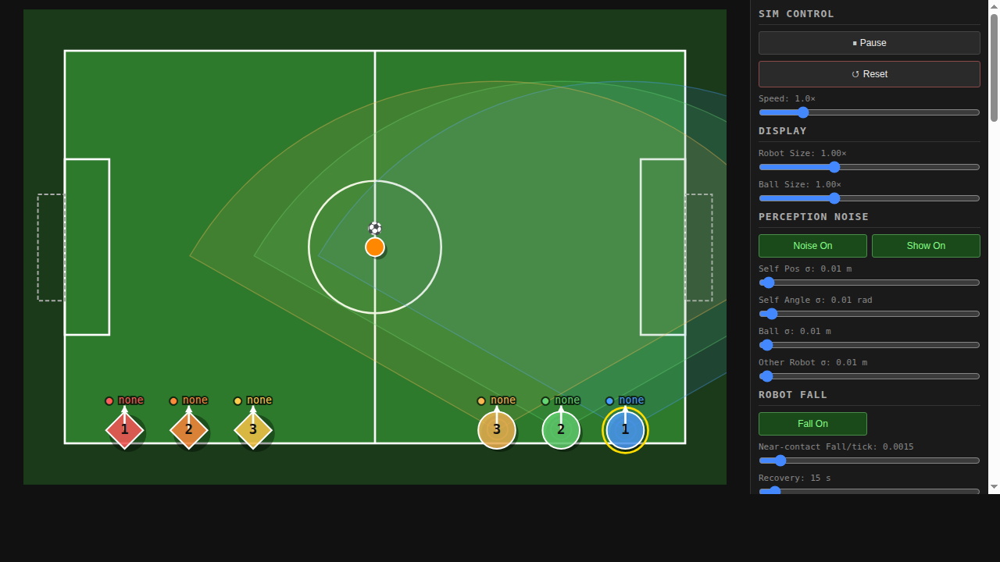

# robocup_match_2d_simulation

A 2D physics match simulator for RoboCup humanoid soccer. Runs a full simulated match (up to 7 vs 3 robots) with a built-in browser UI and sends live UDP team messages so `robocup_realtime_monitoring` can visualize the simulation without real hardware.



> *Screenshot: 2D field with ally robots (circles), opponent robots (diamonds), ball, and sidebar status. Add a screenshot here after launching the tool.*

---

## Features

- **Physics simulation** — robots move with simple kinematics; ball rolls with friction, follows the robot when dribbling, and flies forward on kick
- **Role-based AI** — in `PLAYING` state robots take on chaser / support / guard / goalkeeper roles
- **Keyboard control** — click any robot or the ball in the browser to select it, then use `WASD` / arrow keys to control it manually
- **Built-in web UI** — SVG field rendered in the browser (port **8095**); shows robot state, GC panel, and perception noise controls
- **UDP broadcast** — sends MessageV2 packets (350 bytes) compatible with `robocup_realtime_monitoring`
- **GameController integration** — receives GC packets directly via UDP (port 3838) or subscribes to ROS GC topics
- **Perception noise** — adjustable Gaussian noise on position observations for realistic testing

---

## Quick Start

### Build

```bash
cd <workspace>
colcon build --packages-select robocup_match_2d_simulation
source install/setup.bash
```

### Launch

```bash
ros2 launch robocup_match_2d_simulation sim.launch.py
```

Open `http://localhost:8095` in a browser.

To run with the live monitoring dashboard at the same time:

```bash
# Terminal 1 — simulator
ros2 launch robocup_match_2d_simulation sim.launch.py

# Terminal 2 — live dashboard (receives UDP from the simulator)
ros2 launch robocup_realtime_monitoring robocup_realtime_monitoring.launch.py
# Open http://localhost:8094
```

---

## Configuration

Edit `config/sim_config.yaml` to change robot counts, set-point positions, and simulation parameters.

Key parameters:

| Parameter | Default | Description |
|-----------|---------|-------------|
| `num_robots` | 3 | Number of ally robots |
| `num_opponents` | 3 | Number of opponent robots |
| `team_number` | 25 | UDP port = 10000 + team_number |
| `ui_port` | 8095 | Browser UI port |
| `publish_udp` | true | Enable UDP broadcast |
| `legacy_topic_robot_id` | 1 | Which robot's data to republish as ROS topics |

---

## Keyboard Controls

Select a robot or the ball by clicking it in the browser, then:

| Key | Action |
|-----|--------|
| `W` / `↑` | Move forward (Y+) |
| `S` / `↓` | Move backward (Y−) |
| `A` / `D` | Strafe left / right |
| `Q` / `←` | Rotate counter-clockwise |
| `E` / `→` | Rotate clockwise |

Click **Release Select** or the dropdown to deselect.

---

## UDP Output

Each tick, the simulator broadcasts one MessageV2 packet per robot on:

```
UDP port: 10000 + team_number   (default: 10025)
```

This is the same format as the real robot sender, so `robocup_realtime_monitoring` works with no changes.

---

## Architecture

```
sim_node.py (ROS 2 node + FastAPI)
     │
     ├── Physics loop (threading.Thread)
     │     ├── Robot kinematics (role AI or manual control)
     │     ├── Ball physics (kick, dribble, friction)
     │     └── GC state machine (READY → SET → PLAYING)
     │
     ├── UDP sender → robocup_realtime_monitoring
     │
     └── FastAPI (port 8095)
           ├── GET /  → index.html (SVG field)
           ├── POST /api/select → keyboard control target
           └── GET /api/state → current sim state (JSON)
```

---

## Dependencies

```bash
pip install fastapi uvicorn pyyaml
```

- `rclpy`, `geometry_msgs`, `std_msgs`, `nav_msgs`
- `robocup_msgs` (in this repo)
