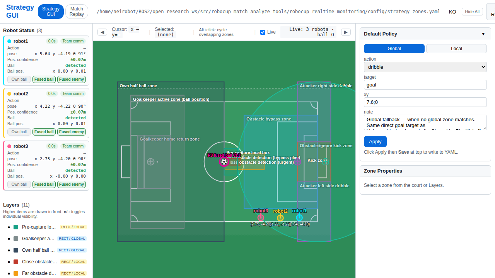

# robocup_realtime_monitoring

A live match dashboard for RoboCup humanoid soccer. Receives UDP team-message broadcasts from robots and renders a browser-based 2D field view in real time.



> *Screenshot: live match dashboard. Add a screenshot here after launching the tool.*

## What It Shows

```
+--------------------------------------------------+
|  RoboCup Field (top-down view)                   |
|                                                  |
|   [R1]          (B)          [O1][O2]            |
|        [R2]           [R3]                       |
|  [ Zone: Defense ] [ Zone: Attack ]              |
|                                                  |
|  Score: 2 - 1  |  Time: 34:12  |  Ready         |
+--------------------------------------------------+
```

- Each robot's position and heading (live)
- Ball position (fused from multiple robot reports)
- Opponent robot positions (merged with 0.5 m cluster radius)
- Strategy zone overlays (rectangles/circles from config)
- GameController state: score, match time, set play, penalties

The web server runs on port **8094** by default. Open `http://localhost:8094` in a browser.

## Quick Start

### 1. Build

```bash
cd ~/ROS2/open_research_ws
colcon build --packages-select robocup_realtime_monitoring
source install/setup.bash
```

### 2. Launch

```bash
ros2 launch robocup_realtime_monitoring robocup_realtime_monitoring.launch.py
```

Then open `http://localhost:8094` in any browser.

## How It Works

Robots broadcast **MessageV2** UDP packets (350 bytes) on port `10000 + team_number` during a match. This package listens for those packets, fuses the data, and streams it to the browser dashboard.

```
Robot 1 --\
Robot 2 ---+--> UDP (port 10000+N) --> udp_listener.py
Robot 3 --/                               |
                                     live_state.py  (ball/opponent fusion)
                                          |
                                     web_server.py  (FastAPI, port 8094)
                                          |
                                     Browser (index.html)
```

## Key Files

| File | Purpose |
|------|---------|
| `robocup_realtime_monitoring/udp_listener.py` | Parses 350-byte MessageV2 UDP packets |
| `robocup_realtime_monitoring/live_state.py` | Fuses ball and opponent positions from multiple robots |
| `robocup_realtime_monitoring/zone_store.py` | Loads and serves strategy zone configuration |
| `robocup_realtime_monitoring/web_server.py` | FastAPI application serving the dashboard |
| `static/strategy/index.html` | Browser UI |
| `config/strategy_zones.yaml` | Field zone definitions |

## Launch Files

| Launch file | Use case |
|-------------|----------|
| `robocup_realtime_monitoring.launch.py` | Full stack (UDP listener + web server) |
| `robocup_strategy_gui.launch.py` | Web server only (no UDP listener) |
| `robocup_udp_sender.launch.py` | Optional: re-broadcast ROS topics as UDP |

## Configuration

### config/strategy_zones.yaml

Defines named zones displayed as overlays on the field. Each zone has a type (`rect` or `circle`), coordinate space (`global` or `local`), geometry, and an action policy.

```yaml
version: 1
defaults:
  global:
    action: dribble
    target: destination
    xy: 1;0
  local:
    action: dribble
    target: destination
    xy: 1;0
zones:
  - id: kick_corridor
    name: Kick zone
    type: rect          # rect | circle
    space: global       # global | local
    geometry:
      x1: 5.5
      y1: -1.5
      x2: 8.0
      y2: 1.5
    action_policy:
      action: dribble   # none | dribble | kick | pass | move_to | turn_to
      target: goal
      xy: 7.6;0
    bt_ref: OnBallCaptured/Attacker/KickCorridor
    color: '#e74c3c'
  - id: goal_proximity
    name: Near-goal circle
    type: circle
    space: global
    geometry:
      cx: 7.0
      cy: 0.0
      r: 6.0
    action_policy:
      action: dribble
      target: goal
      xy: 7.6;0
    bt_ref: OnBallCaptured/Attacker/GoalProximity
    color: '#1abc9c'
```

## Dependencies

- `rclpy` (ROS 2 Python client)
- `fastapi`
- `uvicorn`
- `pydantic`
- `robocup_msgs` (in this repository)

Install Python dependencies:

```bash
pip install fastapi uvicorn pydantic
```
